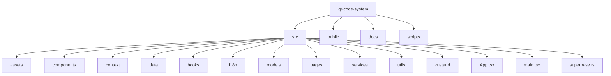

# Sistema de Gerenciamento de QR Codes 🔍

<div align="center">


</div>

<div align="center">
  
  <br>
  <i>Sistema completo para gerenciamento de eventos com QR Codes</i>
</div>

<br>

## 📋 Índice

- [📋 Índice](#-índice)
- [✨ Visão Geral](#-visão-geral)
- [🚀 Tecnologias](#-tecnologias)
- [🏗️ Estrutura do Projeto](#️-estrutura-do-projeto)
- [💡 Principais Funcionalidades](#-principais-funcionalidades)
- [⚙️ Fluxos Principais](#️-fluxos-principais)
- [🛠️ Configuração e Execução](#️-configuração-e-execução)
- [📊 Configuração do Supabase](#-configuração-do-supabase)
- [🔍 Solução de Problemas](#-solução-de-problemas)
- [📖 Mais Documentação](#-mais-documentação)
- [👨‍💻 Contribuição](#-contribuição)
- [📞 Contato](#-contato)

## ✨ Visão Geral

O Sistema de Gerenciamento de QR Codes é uma aplicação web desenvolvida para criar, gerenciar e verificar QR Codes para controle de acesso em eventos. O sistema permite o gerenciamento completo de participantes, envio de convites por WhatsApp, geração de QR Codes personalizados e verificação da validade dos códigos em tempo real.

<details>
<summary>Screenshot da Aplicação</summary>
<div align="center">
  
</div>
</details>

## 🚀 Tecnologias

<div align="center">

| Frontend | Backend |
|:--------:|:-------:|
|  |  |
|  |  |
|  |  |
|  |  |
|  | |
|  | |

</div>

## 🏗️ Estrutura do Projeto



## 💡 Principais Funcionalidades

<table>
  <tr>
    <th>Funcionalidade</th>
    <th>Descrição</th>
  </tr>
  <tr>
    <td>
      <div align="center">
        <h3>👥 Gerenciamento de Participantes</h3>
      </div>
    </td>
    <td>
      <ul>
        <li>Cadastro completo com nome, sobrenome, e-mail, telefone e foto</li>
        <li>Listagem com filtros e pesquisa</li>
        <li>Edição e exclusão de participantes</li>
        <li>Seleção múltipla e ações em lote</li>
      </ul>
    </td>
  </tr>
  <tr>
    <td>
      <div align="center">
        <h3>🔄 Geração de QR Codes</h3>
      </div>
    </td>
    <td>
      <ul>
        <li>Geração de QR Code único para cada participante</li>
        <li>Visualização e compartilhamento do QR Code</li>
        <li>Integração com WhatsApp para envio direto</li>
      </ul>
    </td>
  </tr>
  <tr>
    <td>
      <div align="center">
        <h3>📱 Verificação de QR Codes</h3>
      </div>
    </td>
    <td>
      <ul>
        <li>Leitura de QR Codes via câmera</li>
        <li>Validação automática dos participantes</li>
        <li>Marcação do status de leitura</li>
      </ul>
    </td>
  </tr>
  <tr>
    <td>
      <div align="center">
        <h3>🔐 Autenticação e Autorização</h3>
      </div>
    </td>
    <td>
      <ul>
        <li>Login e registro de usuários</li>
        <li>Recuperação de senha</li>
        <li>Controle de acesso baseado em perfis (USER, ADMIN, MASTER)</li>
        <li>Proteção de rotas</li>
      </ul>
    </td>
  </tr>
  <tr>
    <td>
      <div align="center">
        <h3>🌐 Internacionalização</h3>
      </div>
    </td>
    <td>
      <ul>
        <li>Suporte a múltiplos idiomas</li>
        <li>Detecção automática do idioma do navegador</li>
        <li>Seleção manual de idioma</li>
      </ul>
    </td>
  </tr>
</table>

## ⚙️ Fluxos Principais

<div>
  <details open>
    <summary><b>📝 Cadastro e Envio de QR Code</b></summary>
    <ol>
      <li>Acesse a página de Participantes</li>
      <li>Clique em "Adicionar Participante"</li>
      <li>Preencha os dados do participante</li>
      <li>Após o cadastro, o participante aparecerá na lista</li>
      <li>Clique no botão de WhatsApp para enviar o QR Code</li>
      <li>O status "Enviado" será atualizado automaticamente</li>
    </ol>
  </details>
  
  <details>
    <summary><b>📷 Leitura e Verificação de QR Code</b></summary>
    <ol>
      <li>Acesse a página de Leitura</li>
      <li>Permita o acesso à câmera quando solicitado</li>
      <li>Aponte para o QR Code do participante</li>
      <li>O sistema verificará automaticamente a validade</li>
      <li>Exibirá as informações do participante se for válido</li>
      <li>O status "Lido" será atualizado</li>
    </ol>
  </details>
</div>

## 🛠️ Configuração e Execução

### Pré-requisitos

- Node.js v16 ou superior
- NPM ou Yarn
- Acesso ao Supabase (solicitar credenciais)

### Instalação

1. Clone o repositório

```bash
# Clone o repositório
git clone [url-do-repositorio]
cd qr-code-system

# Instale as dependências
npm install
# ou
yarn
```

2. Configure as variáveis de ambiente

```bash
# Crie um arquivo .env
cp .env.example .env

# Edite com suas credenciais
VITE_SUPABASE_URL=sua_url_do_supabase
VITE_SUPABASE_KEY=sua_chave_do_supabase
```

3. Execute a aplicação

```bash
# Modo de desenvolvimento
npm run dev
# ou
yarn dev

# Build para produção
npm run build
# ou
yarn build
```

## 📊 Configuração do Supabase

<div style="background-color: #f5f5f5; padding: 15px; border-radius: 5px; margin: 10px 0;">

O sistema utiliza o Supabase como backend com as seguintes tabelas principais:

- `participants`: Armazena dados dos participantes
- `user_profiles`: Mantém os perfis de usuários

As políticas de segurança (RLS) garantem que:
- 🔒 Usuários comuns só podem ver seus próprios dados
- 🔒 Administradores têm acesso a todos os participantes
- 🔒 Apenas MASTER pode gerenciar outros usuários

Para mais detalhes, consulte a [documentação completa do banco de dados](./ESTRUTURA-BANCO.md).

</div>

## 🔍 Solução de Problemas

<table>
  <tr>
    <th>Problema</th>
    <th>Solução</th>
  </tr>
  <tr>
    <td>Erros de RLS (403 Forbidden)</td>
    <td>
      <ol>
        <li>Verifique se o usuário tem o perfil adequado</li>
        <li>Consulte as políticas RLS no Supabase</li>
        <li>Use funções de serviço que possuem privilégios elevados</li>
      </ol>
    </td>
  </tr>
  <tr>
    <td>Erros de Autenticação</td>
    <td>
      <ol>
        <li>Verifique as credenciais do Supabase</li>
        <li>Limpe os dados de autenticação no navegador</li>
        <li>Verifique se o email foi confirmado (se necessário)</li>
      </ol>
    </td>
  </tr>
</table>

## 📖 Mais Documentação

<div style="display: flex; flex-wrap: wrap; gap: 20px; justify-content: center;">
  <a href="./ESTRUTURA-BANCO.md" style="text-decoration: none;">
    <div style="width: 200px; height: 100px; padding: 20px; background-color: #f8f9fa; border-radius: 10px; display: flex; flex-direction: column; justify-content: center; align-items: center; text-align: center;">
      <h3>📊 Banco de Dados</h3>
      <p>Estrutura detalhada do banco</p>
    </div>
  </a>
  <a href="./GUIA-USUARIOS.md" style="text-decoration: none;">
    <div style="width: 200px; height: 100px; padding: 20px; background-color: #f8f9fa; border-radius: 10px; display: flex; flex-direction: column; justify-content: center; align-items: center; text-align: center;">
      <h3>📚 Guia do Usuário</h3>
      <p>Instruções detalhadas de uso</p>
    </div>
  </a>
  <a href="./CONTRIBUICAO.md" style="text-decoration: none;">
    <div style="width: 200px; height: 100px; padding: 20px; background-color: #f8f9fa; border-radius: 10px; display: flex; flex-direction: column; justify-content: center; align-items: center; text-align: center;">
      <h3>👨‍💻 Contribuição</h3>
      <p>Como contribuir com o projeto</p>
    </div>
  </a>
</div>

## 👨‍💻 Contribuição

Para contribuir com o projeto:

```javascript
// 1. Faça um fork do projeto
// 2. Crie uma branch para sua feature
git checkout -b feature/nova-funcionalidade

// 3. Commit suas mudanças
git commit -m 'feat: adiciona nova funcionalidade'

// 4. Push para a branch
git push origin feature/nova-funcionalidade

// 5. Abra um Pull Request
```

Consulte o [guia de contribuição](./CONTRIBUICAO.md) para mais detalhes.

## 📞 Contato

Para suporte ou esclarecimentos, entre em contato com a equipe de desenvolvimento. 
